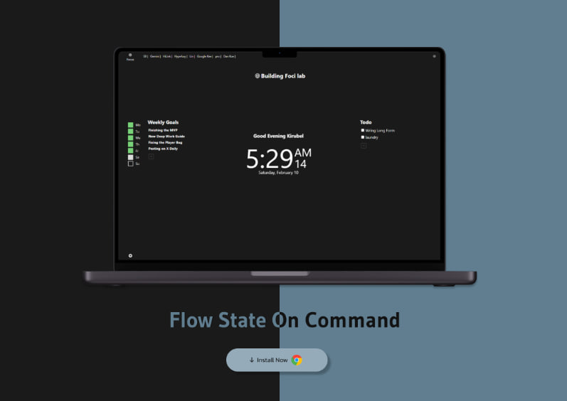

# Kirubel Portfolio

Welcome to Kirubel's portfolio!

RCD 0824 2014
Kirubel Demelash

## Introduction

Hi, I'm Kirubel. Nice to meet you! I'm a passionate Full Stack Developer and writer. Since beginning my journey into coding nearly 4 years ago, I've completed many programming projects and continuously upgraded my skills. I'm confident in tackling larger projects now. Programming has become my life; I'm always contemplating how to solve problems around me and create real value for other people.

## Skills

- **HTML:** Proficient in creating structured and semantic web pages using HTML.
- **CSS:** Skilled in styling and designing web pages using CSS, including responsive design and CSS frameworks.
- **React:** Experience in building dynamic and interactive user interfaces using React library.
- **JavaScript (JS):** Strong command over JavaScript for implementing client-side functionalities and enhancing user experience.

## Main Projects

### 1. FociLab

- A Chrome extension for productivity and planning. Ideal for creators and writers.
- [Link](https://focilab.com/)
  

### 2. Rewire

- A Program for Young men to build discipline and master themselves.
- [Link](https://rewire-five.vercel.app/)
  

<!-- Add more projects as needed -->

## Contact Information

Feel free to reach out to me via email or connect with me on social media:

- **Email:** [kiztopia@gmail.com](mailto:kiztopia@gmail.com)
- **Twitter:** [@\_KirubelD](https://twitter.com/_KirubelD)

<!-- Add more social media links as needed -->
